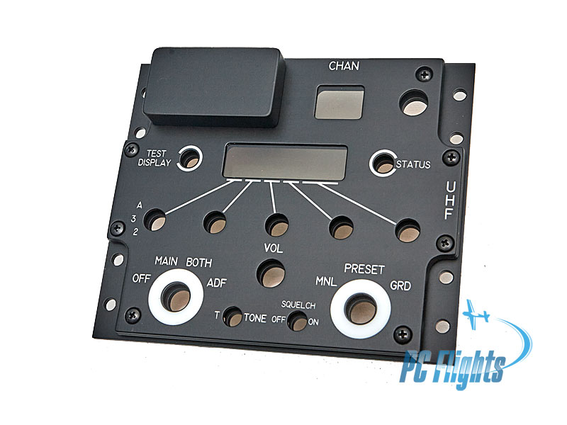

# ARC-164 Radio Panel for DCS

  

*Panel reference photo: PC Flights.*

## My next project

Once I have completed the [ARC-210 radio panel](https://github.com/dgdimick/ARC-210-DCS-Display), the **AN/ARC-164 UHF radio panel** will be my next project.

The plan is to build a physical ARC-164 panel for my DCS A-10C II cockpit, with working controls and a display linked to DCS through DCS-BIOS.

This repository is a placeholder for now. I am exploring display options and the panel layout, but the ARC-210 remains my priority. There is no firmware or finished hardware design available here yet, and I have not set a release date.

As development progresses, I will add build notes, hardware details, firmware, and photos here.

## PC Flights affiliation

I am not affiliated with PC Flights in any way. I simply chose to use their panels for my own cockpit projects.
